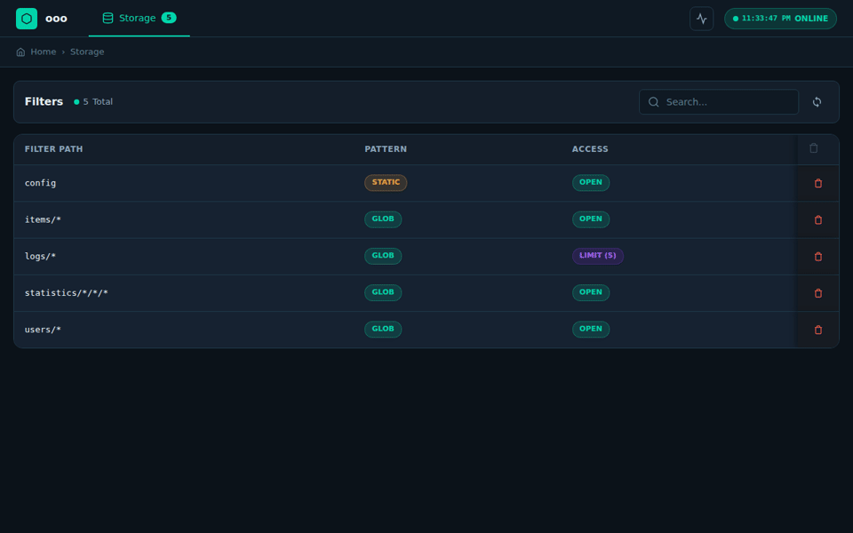

<p align="center">
  
</p>

# ooo

<p align="center">
  
</p>

[](https://github.com/benitogf/ooo/actions/workflows/tests.yml)

State management with real-time network access.

**ooo** provides a fast, zero-configuration In-memory layer for storing and synchronizing application state or settings. It uses an embedded storage engine with optional persistence via [ko](https://github.com/benitogf/ko), and delivers changes to subscribers using [JSON Patch](http://jsonpatch.com) for efficient updates.

### When to use ooo

- **Application state/settings** that need real-time sync across clients
- **Prototyping** real-time features quickly
- **Small to medium datasets** where speed matters more than scale

### When NOT to use ooo

For large-scale data storage (millions of records, complex queries), use a dedicated database like [nopog](https://github.com/benitogf/nopog). You can combine both: ooo for real-time state, nopog for bulk data.

## Ecosystem

| Package | Description |
|---------|-------------|
| [ooo](https://github.com/benitogf/ooo) | Core server - in-memory state with WebSocket/REST API |
| [ko](https://github.com/benitogf/ko) | Persistent storage adapter (LevelDB) |
| [ooo-client](https://github.com/benitogf/ooo-client) | JavaScript client with reconnecting WebSocket |
| [auth](https://github.com/benitogf/auth) | JWT authentication middleware |
| [mono](https://github.com/benitogf/mono) | Full-stack boilerplate (Go + React) |
| [nopog](https://github.com/benitogf/nopog) | PostgreSQL adapter for large-scale storage |
| [pivot](https://github.com/benitogf/pivot) | Multi-instance synchronization (AP distributed) |

## Features

- Dynamic routing with glob patterns for collections
- Real-time subscriptions via WebSocket
- [JSON Patch](http://jsonpatch.com) updates for efficient sync
- Version checking (no data sent on version match while reconnecting)
- RESTful CRUD reflected to subscribers
- Filtering and audit middleware
- Auto-managed timestamps (created, updated) with a monotonic clock for consistency on ntp/ptp synchronizations
- Built-in web UI for data management

## quickstart

### client

There's a [js client](https://www.npmjs.com/package/ooo-client).

### server

with [go installed](https://golang.org/doc/install) get the library

```bash
go get github.com/benitogf/ooo
```

create a file `main.go`
```golang
package main

import "github.com/benitogf/ooo"

func main() {
  server := ooo.Server{}
  server.Start("0.0.0.0:8800")
  server.WaitClose()
}
```

run the service:
```bash
go run main.go
```

# API Reference

### UI & Management

| Method | Description | URL |
|--------|-------------|-----|
| GET | Web interface | `http://{host}:{port}/` |
| GET | List all keys (paginated) | `http://{host}:{port}/?api=keys` |
| GET | Server info | `http://{host}:{port}/?api=info` |
| GET | Filter paths | `http://{host}:{port}/?api=filters` |
| GET | Connection state | `http://{host}:{port}/?api=state` |

#### Keys API Query Parameters

| Parameter | Description | Default |
|-----------|-------------|---------|
| `page` | Page number (1-indexed) | 1 |
| `limit` | Items per page (max 500) | 50 |
| `filter` | Filter by prefix or glob pattern | (none) |

### Data Operations

| Method | Description | URL |
|--------|-------------|-----|
| POST | Create/Update | `http://{host}:{port}/{key}` |
| GET | Read | `http://{host}:{port}/{key}` |
| PATCH | Partial update (JSON Patch) | `http://{host}:{port}/{key}` |
| DELETE | Delete | `http://{host}:{port}/{key}` |

### WebSocket

| Method | Description | URL |
|--------|-------------|-----|
| WS | Server clock | `ws://{host}:{port}` |
| WS | Subscribe to path | `ws://{host}:{port}/{key}` |


# control

### static routes

Activating this flag will limit the server to process requests defined by filters

```golang
server := ooo.Server{}
server.Static = true
```


### Filters

Filters control access and transform data. When `Static` mode is enabled, only filtered routes are available.

Paths support glob patterns (`*`) and multi-level globs like `users/*/posts/*`.

| Filter | Description |
|--------|-------------|
| `OpenFilter` | Enable route (required in static mode) |
| `WriteFilter` | Transform/validate before write |
| `AfterWriteFilter` | Callback after write completes |
| `ReadObjectFilter` | Transform single object on read |
| `ReadListFilter` | Transform list items on read |
| `DeleteFilter` | Control delete operations |
| `LimitFilter` | Maintain max entries in a list (auto-cleanup) |

#### OpenFilter

```go
// Enable a route (required when Static=true)
server.OpenFilter("books/*")
```

#### WriteFilter

```go
// Validate/transform before write
server.WriteFilter("books/*", func(index string, data json.RawMessage) (json.RawMessage, error) {
    // return error to deny, or modified data
    return data, nil
})
```

#### AfterWriteFilter

```go
// Callback after write completes
server.AfterWriteFilter("books/*", func(index string) {
    log.Println("wrote:", index)
})
```

#### ReadObjectFilter

```go
// Transform single object on read
server.ReadObjectFilter("books/special", func(index string, data meta.Object) (meta.Object, error) {
    return data, nil
})
```

#### ReadListFilter

```go
// Transform list items on read
server.ReadListFilter("books/*", func(index string, items []meta.Object) ([]meta.Object, error) {
    return items, nil
})
```

#### DeleteFilter

```go
// Control delete (return error to prevent)
server.DeleteFilter("books/protected", func(key string) error {
    return errors.New("cannot delete")
})
```

#### LimitFilter

`LimitFilter` is implemented using a `ReadListFilter` (to limit visible items), a noop `WriteFilter` (to allow writes), a `DeleteFilter` (to allow deletes), and an `AfterWriteFilter` (to trigger cleanup). This means it includes open read and write access.

```go
// Limit list to N most recent entries (auto-deletes oldest)
server.LimitFilter("logs/*", 100)
```

### Audit

```go
server.Audit = func(r *http.Request) bool {
    // return true to allow, false to deny (401)
    return r.Header.Get("X-API-Key") == "secret"
}
```

### Custom Endpoints

Register custom HTTP endpoints with typed schemas visible in the UI.

```go
server.Endpoint(ooo.EndpointConfig{
    Path:        "/policies/{id}",
    Description: "Manage access control policies",
    // Vars are route variables (mandatory) - auto-extracted from {id} in path
    Vars: ooo.Vars{"id": "Policy ID"},
    Methods: ooo.Methods{
        "GET": ooo.MethodSpec{
            Response: PolicyResponse{},
            // Params are query parameters (optional) - per method
            Params: ooo.Params{"filter": "Optional filter value"},
        },
        "PUT": ooo.MethodSpec{
            Request:  Policy{},
            Response: PolicyResponse{},
        },
    },
    Handler: func(w http.ResponseWriter, r *http.Request) {
        id := mux.Vars(r)["id"]           // Route variable (mandatory)
        filter := r.URL.Query().Get("filter") // Query param (optional)
        // ... handle request
    },
})
```

### Proxies

Forward filters from remote ooo servers with path remapping.

```go
// Proxy /settings/{deviceID} → /settings on remote
proxy.Route(server, "settings/*", proxy.Config{
    Resolve: func(localPath string) (address, remotePath string, err error) {
        return "localhost:8800", "settings", nil
    },
})

// Proxy list routes: /items/{deviceID}/* → /items/* on remote
proxy.RouteList(server, "items/*/*", proxy.Config{
    Resolve: func(localPath string) (address, remotePath string, err error) {
        parts := strings.SplitN(localPath, "/", 3)
        if len(parts) == 3 {
            return "localhost:8800", "items/" + parts[2], nil
        }
        return "localhost:8800", "items/*", nil
    },
})
```

## I/O Operations

These functions handle JSON serialization/deserialization and provide a more convenient way to work with your data structures than using storage api directly.

### Basic Operations

#### Get a Single Item

```go
// Get retrieves a single item from the specified path
item, err := ooo.Get[YourType](server, "path/to/item")
if err != nil {
    log.Fatal(err)
}
fmt.Printf("Item: %+v\n", item.Data)
```

#### Get a List of Items

```go
// GetList retrieves all items from a list path (ends with "/*")
items, err := ooo.GetList[YourType](server, "path/to/items/*")
if err != nil {
    log.Fatal(err)
}
for _, item := range items {
    fmt.Printf("Item: %+v (created: %v)\n", item.Data, item.Created)
}
```

#### Set an Item

```go
// Set creates or updates an item at the specified path
err := ooo.Set(server, "path/to/item", YourType{
    Field1: "value1",
    Field2: "value2",
})
if err != nil {
    log.Fatal(err)
}
```

#### Add to a List

```go
// Push adds an item to a list (path must end with "/*")
index, err := ooo.Push(server, "path/to/items/*", YourType{
    Field1: "new item",
    Field2: "another value",
})
if err != nil {
    log.Fatal(err)
}
fmt.Println("Created at:", index)
```

#### Delete Item(s)

```go
// Delete removes item(s) at the specified path
// For single item: ooo.Delete(server, "path/to/item")
// For glob pattern: ooo.Delete(server, "items/*") removes all matching items
err := ooo.Delete(server, "path/to/item")
if err != nil {
    log.Fatal(err)
}
```

### Remote Operations

Perform operations on remote ooo servers using the `io` package.

#### RemoteConfig

```go
cfg := io.RemoteConfig{
    Client: &http.Client{Timeout: 10 * time.Second},
    Host:   "localhost:8800",
    SSL:    false, // set to true for HTTPS
}
```

#### RemoteGet

```go
item, err := io.RemoteGet[YourType](cfg, "path/to/item")
```

#### RemoteSet

```go
err := io.RemoteSet(cfg, "path/to/item", YourType{Field1: "value"})
```

#### RemotePush

```go
err := io.RemotePush(cfg, "path/to/items/*", YourType{Field1: "new item"})
```

#### RemoteGetList

```go
items, err := io.RemoteGetList[YourType](cfg, "path/to/items/*")
```

#### RemoteDelete

```go
err := io.RemoteDelete(cfg, "path/to/item")
```


### Subscribe Clients

Use the Go WebSocket client to subscribe to real-time updates.

#### SubscribeList

```go
go client.SubscribeList(client.SubscribeConfig{
    Ctx:  ctx,
    Server: client.Server{Protocol: "ws", Host: "localhost:8800"},
}, "items/*", client.SubscribeListEvents[Item]{
    OnMessage: func(items []client.Meta[Item]) { /* handle updates */ },
    OnError:   func(err error) { /* handle error */ },
})
```

#### Subscribe

```go
go client.Subscribe(client.SubscribeConfig{
    Ctx:  ctx,
    Server: client.Server{Protocol: "ws", Host: "localhost:8800"},
}, "config", client.SubscribeEvents[Config]{
    OnMessage: func(item client.Meta[Config]) { /* handle updates */ },
    OnError:   func(err error) { /* handle error */ },
})
```

#### SubscribeMultipleList2

```go
go client.SubscribeMultipleList2(
    client.SubscribeConfig{
        Ctx:  ctx,
        Server: client.Server{Protocol: "ws", Host: "localhost:8800"},
    },
    [2]string{"products/*", "orders/*"},
    client.SubscribeMultipleList2Events[Product, Order]{
        OnMessage: func(products client.MultiState[Product], orders client.MultiState[Order]) {
            // products.Updated / orders.Updated indicates which changed
        },
    },
)
```

For JavaScript, use [ooo-client](https://github.com/benitogf/ooo-client).

## UI

ooo includes a built-in web-based ui to manage and monitor your data. The ui is automatically available at the root path (`/`) when the server starts.

### Features

- **Storage Browser** - Browse all registered filters and their data
- **Live Mode** - Real-time WebSocket subscriptions with automatic updates
- **Static Mode** - Traditional CRUD operations with JSON editor
- **State Monitor** - View active WebSocket connections and subscriptions
- **Filter Management** - Visual representation of filter types (open, read-only, write-only, custom, limit)
