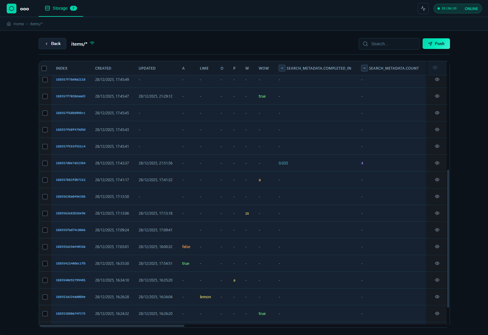

<p align="center">
  
</p>

# ooo

[](https://github.com/benitogf/ooo/actions/workflows/tests.yml)

Zero configuration data persistence and communication layer.

Dynamic websocket and restful http service to quickly prototype realtime applications.

## features

- dynamic routing
- glob pattern routes for lists
- [patch](http://jsonpatch.com) updates on lists subscriptions
- version check on subscriptions (no message on version match)
- restful CRUD service that reflects interactions to real-time subscriptions
- filtering and audit middleware
- auto managed timestamps (created, updated)

## quickstart

### client

There's a [js client](https://www.npmjs.com/package/ooo-client).

### server

with [go installed](https://golang.org/doc/install) get the library

```bash
go get github.com/benitogf/ooo
```

create a file `main.go`
```golang
package main

import "github.com/benitogf/ooo"

func main() {
  app := ooo.Server{}
  app.Start("0.0.0.0:8800")
  app.WaitClose()
}
```

run the service:
```bash
go run main.go
```

# routes

| method | description | url    |
| ------------- |:-------------:| -----:|
| GET | key list | http://{host}:{port} |
| websocket| clock | ws://{host}:{port} |
| POST | create/update | http://{host}:{port}/{key} |
| GET | read | http://{host}:{port}/{key} |
| DELETE | delete | http://{host}:{port}/{key} |
| websocket| subscribe | ws://{host}:{port}/{key} |


# control

### static routes

Activating this flag will limit the server to process requests defined in read and write filters

```golang
app := ooo.Server{}
app.Static = true
```


### filters

- Write filters will be called before processing a write operation
- Read filters will be called before sending the results of a read operation
- if the static flag is enabled only filtered routes will be available

```golang
app.WriteFilter("books/*", func(index string, data json.RawMessage) (json.RawMessage, error) {
  // returning an error will deny the write
  return data, nil
})
app.AfterWriteFilter("books/*", func(index string) {
  // trigger after a write is done
  log.Println("wrote data on ", index)
})
app.ReadObjectFilter("books/taup", func(index string, data meta.Object) (meta.Object, error) {
  // returning an error will deny the read
  return data, nil
})
app.DeleteFilter("books/taup", func(key string) (error) {
  // returning an error will prevent the delete
  return errors.New("can't delete")
})
```

### audit

```golang
app.Audit = func(r *http.Request) bool {
  return false // condition to allow access to the resource
}
```

### Example: static routes + filters + audit

```go
package main

import (
    "encoding/json"
    "errors"
    "log"
    "net/http"

    "github.com/benitogf/ooo"
    "github.com/benitogf/ooo/meta"
)

type Book struct {
    Title  string `json:"title"`
    Author string `json:"author"`
    Secret string `json:"secret,omitempty"`
}

func main() {
    app := ooo.Server{Static: true}

    // Only allow requests that carry a valid API key
    app.Audit = func(r *http.Request) bool {
        return r.Header.Get("X-API-Key") == "secret"
    }

    // Make the list route available while Static mode is enabled
    app.OpenFilter("books/*")
    app.OpenFilter("books/locked") // single resource example

    // Sanitize/validate before writes to the list
    app.WriteFilter("books/*", func(index string, data json.RawMessage) (json.RawMessage, error) {
        var b Book
        err := json.Unmarshal(data, &b)
        if err != nil {
            return nil, err
        }
        if b.Title == "" {
            return nil, errors.New("title is required")
        }
        if b.Author == "" {
            b.Author = "unknown"
        }
        // Persist possibly modified payload
        out, _ := json.Marshal(b)
        return out, nil
    })

    // Log after any write
    app.AfterWriteFilter("books/*", func(index string) {
        log.Println("wrote book at", index)
    })

    // Hide secrets on reads (for lists)
    app.ReadListFilter("books/*", func(index string, objs []meta.Object) ([]meta.Object, error) {
        for i := range objs {
            var b Book
            json.Unmarshal(objs[i].Data, &b)
            b.Secret = ""
            objs[i].Data, _ = json.Marshal(b)
        }
        return objs, nil
    })

    // Prevent deleting a specific resource
    app.DeleteFilter("books/locked", func(key string) error {
        return errors.New("this book cannot be deleted")
    })

    app.Start("0.0.0.0:8800")
    app.WaitClose()
}
```

You can try it with curl:

```bash
# Create a book (note the X-API-Key header and list path with /*)
curl -sS -H 'X-API-Key: secret' -H 'Content-Type: application/json' \
  -d '{"title":"Dune","author":"Frank Herbert","secret":"token"}' \
  http://localhost:8800/books/*

# Read all books (secrets are removed by the ReadFilter)
curl -sS -H 'X-API-Key: secret' http://localhost:8800/books/* | jq .

# Attempt a write without the API key (Audit will reject it)
curl -sS -H 'Content-Type: application/json' \
  -d '{"title":"NoAuth"}' http://localhost:8800/books/* -i

# Attempt to delete the protected resource
curl -sS -X DELETE -H 'X-API-Key: secret' http://localhost:8800/books/locked -i
```

### subscribe events capture

```golang
// new subscription event
server.OnSubscribe = func(key string) error {
  log.Println(key)
  // returning an error will deny the subscription
  return nil
}
// closing subscription event
server.OnUnsubscribe = func(key string) {
  log.Println(key)
}
```

### extra routes

```golang
// Define custom endpoints
app.Router = mux.NewRouter()
app.Router.HandleFunc("/test", func(w http.ResponseWriter, r *http.Request) {
  w.Header().Set("Content-Type", "application/json")
  fmt.Fprintf(w, "{}")
})
app.Start("0.0.0.0:8800")
```

### write/read storage api

```golang
package main

import (
	"encoding/json"
	"log"
	"strconv"
	"time"

	"github.com/benitogf/ooo"
	"github.com/benitogf/ooo/meta"
)

type Game struct {
	Started int64 `json:"started"`
}

// not good practice, for illustration purposes only
// handle errors responsably :)
func panicHandle(err error) {
	if err != nil {
		panic(err)
	}
}

func main() {
	// create a static server
	server := ooo.Server{
		Static: true,
	}
	// define the path so it's available throug http/ws
	server.OpenFilter("game")

	// start the server/storage (default to memory storage)
	server.Start("0.0.0.0:8800")

	// write
	timestamp := strconv.FormatInt(time.Now().UnixNano(), 10)
	index, err := server.Storage.Set("game", json.RawMessage(`{"started": `+timestamp+`}`))
	panicHandle(err)
	log.Println("stored in", index)

	// read
	data, err := server.Storage.Get("game")
	panicHandle(err)
	dataObject, err := meta.Decode(data)
	panicHandle(err)
	log.Println("created", dataObject.Created)
	log.Println("updated", dataObject.Updated)
	log.Println("data", string(dataObject.Data))

	// parse json to struct
	game := Game{}
	err = json.Unmarshal(dataObject.Data, &game)
	panicHandle(err)
	log.Println("started", game.Started)

	// close server handler
	server.WaitClose()
}
```

## I/O Operations

The `ooo` package provides functions for working with data through the OOO server. These functions handle JSON serialization/deserialization and provide a more convenient way to work with your data structures.

### Basic Operations

#### Get a Single Item

```go
// Get retrieves a single item from the specified path
item, err := io.Get[YourType](server, "path/to/item")
if err != nil {
    log.Fatal(err)
}
fmt.Printf("Item: %+v\n", item.Data)
```

#### Get a List of Items

```go
// GetList retrieves all items from a list path (ends with "/*")
items, err := io.GetList[YourType](server, "path/to/items/*")
if err != nil {
    log.Fatal(err)
}
for _, item := range items {
    fmt.Printf("Item: %+v (created: %v)\n", item.Data, item.Created)
}
```

#### Set an Item

```go
// Set creates or updates an item at the specified path
err := io.Set(server, "path/to/item", YourType{
    Field1: "value1",
    Field2: "value2",
})
if err != nil {
    log.Fatal(err)
}
```

#### Add to a List

```go
// Push adds an item to a list (path must end with "/*")
err := io.Push(server, "path/to/items/*", YourType{
    Field1: "new item",
    Field2: "another value",
})
if err != nil {
    log.Fatal(err)
}
```

### Remote Operations

You can also perform operations on remote OOO servers using the client functions:

```go
// Create a remote config
cfg := io.RemoteConfig{
    Client: &http.Client{Timeout: 10 * time.Second},
    Host:   "localhost:8800",
    SSL:    false, // set to true for HTTPS
}

// RemoteGet fetches an item from a remote server
item, err := io.RemoteGet[YourType](cfg, "path/to/item")

// RemoteSet updates or creates an item on a remote server
err = io.RemoteSet(cfg, "path/to/item", YourType{Field1: "value"})

// RemotePush adds an item to a list on a remote server
err = io.RemotePush(cfg, "path/to/items/*", YourType{Field1: "new item"})

// RemoteGetList fetches all items from a list on a remote server
items, err := io.RemoteGetList[YourType](cfg, "path/to/items/*")

// RemoteDelete deletes an item
err = io.RemoteDelete(cfg, "path/to/item")
```

#### Basic IO example

Here's a complete example demonstrating the usage of these functions:

```go
package main

import (
	"fmt"
	"log"
	"net/http"
	"time"

	"github.com/benitogf/ooo"
	"github.com/benitogf/ooo/io"
)

type Todo struct {
	Task      string    `json:"task"`
	Completed bool      `json:"completed"`
	Due       time.Time `json:"due"`
}

func main() {
	// Start a local server for testing
	server := &ooo.Server{Silence: true}
	server.Start("localhost:0")
	defer server.Close(nil)

	// Add some todos
	err := io.Push(server, "todos/*", Todo{
		Task:      "todo 1",
		Completed: false,
		Due:       time.Now().Add(24 * time.Hour),
	})
	if err != nil {
		log.Fatal(err)
	}

	err = io.Push(server, "todos/*", Todo{
		Task:      "todo 2",
		Completed: false,
		Due:       time.Now().Add(48 * time.Hour),
	})
	if err != nil {
		log.Fatal(err)
	}

	// Get all todos
	todos, err := io.GetList[Todo](server, "todos/*")
	if err != nil {
		log.Fatal(err)
	}

	fmt.Println("All todos:")
	for i, todo := range todos {
		fmt.Printf("%d. %s (Due: %v)\n", i+1, todo.Data.Task, todo.Data.Due)
	}
}
```

### WebSocket client

Use the Go websocket client to subscribe to real-time updates on any path. There are two functions:

- `Subscribe[T]` - for single object paths (non-glob)
- `SubscribeList[T]` - for list paths (glob patterns like `todos/*`)

Both use a `SubscribeConfig` struct for connection settings and event callbacks.

```go
// SubscribeConfig holds connection configuration
type SubscribeConfig struct {
    Ctx              context.Context
    Protocol         string        // "ws" or "wss"
    Host             string        // e.g. "localhost:8800"
    Header           http.Header   // optional headers
    HandshakeTimeout time.Duration // optional, defaults to 2s
    Silence          bool          // suppress log output
}

// For single objects
type SubscribeEvents[T any] struct {
    OnMessage func(client.Meta[T])
    OnError   func(error) // optional
}

// For lists
type SubscribeListEvents[T any] struct {
    OnMessage func([]client.Meta[T])
    OnError   func(error) // optional
}
```

The client automatically reconnects with exponential backoff if the connection drops. Cancel the context to stop the subscription.

#### Example: subscribe to a list

```go
package main

import (
    "context"
    "fmt"
    "time"

    "github.com/benitogf/ooo"
    "github.com/benitogf/ooo/io"
    "github.com/benitogf/ooo/client"
)

type Todo struct {
    Task      string    `json:"task"`
    Completed bool      `json:"completed"`
    Due       time.Time `json:"due"`
}

func main() {
    // Start server (for demo)
    server := &ooo.Server{Silence: true}
    server.Start("localhost:0")
    defer server.Close(nil)

    // Seed one item
    _ = io.Push(server, "todos/*", Todo{Task: "seed", Due: time.Now().Add(1 * time.Hour)})

    ctx, cancel := context.WithCancel(context.Background())
    defer cancel()

    cfg := client.SubscribeConfig{
        Ctx:      ctx,
        Protocol: "ws",
        Host:     server.Address,
        Silence:  true,
    }

    go client.SubscribeList[Todo](cfg, "todos/*", client.SubscribeListEvents[Todo]{
        OnMessage: func(items []client.Meta[Todo]) {
            fmt.Println("list size:", len(items))
            for i, it := range items {
                fmt.Printf("%d. %s (due: %v)\n", i+1, it.Data.Task, it.Data.Due)
            }
        },
        OnError: func(err error) {
            fmt.Println("connection error:", err)
        },
    })

    // Produce updates
    time.Sleep(50 * time.Millisecond)
    _ = io.Push(server, "todos/*", Todo{Task: "another", Due: time.Now().Add(2 * time.Hour)})

    time.Sleep(300 * time.Millisecond)
}
```

#### Example: subscribe to a single item

```go
ctx, cancel := context.WithCancel(context.Background())
defer cancel()

cfg := client.SubscribeConfig{
    Ctx:      ctx,
    Protocol: "ws",
    Host:     server.Address,
}

// Ensure path exists
_ = io.Set(server, "todo", Todo{Task: "one", Due: time.Now().Add(24 * time.Hour)})

go client.Subscribe[Todo](cfg, "todo", client.SubscribeEvents[Todo]{
    OnMessage: func(item client.Meta[Todo]) {
        fmt.Println("current todo:", item.Data.Task)
    },
    OnError: func(err error) {
        fmt.Println("connection error:", err)
    },
})

// Update the item to trigger a message
_ = io.Set(server, "todo", Todo{Task: "updated"})
```

#### HTTPS (wss) usage

If your server is behind TLS, use the `wss` protocol:

```go
cfg := client.SubscribeConfig{
    Ctx:      ctx,
    Protocol: "wss",
    Host:     "example.com:443",
}
go client.SubscribeList[Todo](cfg, "todos/*", client.SubscribeListEvents[Todo]{
    OnMessage: func(items []client.Meta[Todo]) {
        // handle items
    },
    OnError: func(err error) {
        // handle connection error
    },
})
```

#### Tuning and lifecycle

- `HandshakeTimeout` can be set in the config (default: 2 seconds)
- Retry delays can be configured via `SubscribeConfig.Retry`
- The callback runs in the client's goroutine; keep work minimal or offload to channels
- Call `cancel()` on the context to close the websocket and stop reconnection attempts

#### Subscribe to multiple paths

Use `SubscribeMultipleList2`, `SubscribeMultipleList3`, or `SubscribeMultipleList4` to subscribe to multiple paths with different types and receive combined state updates in a single callback.

```go
type User struct {
    ID   int    `json:"id"`
    Name string `json:"name"`
}

type Post struct {
    ID    int    `json:"id"`
    Title string `json:"title"`
}

ctx, cancel := context.WithCancel(context.Background())
defer cancel()

client.SubscribeMultipleList2(
    ctx,
    client.Path{Protocol: "ws", Host: server.Address, Path: "users/*"},
    client.Path{Protocol: "ws", Host: server.Address, Path: "posts/*"},
    client.SubscribeMultipleList2Events[User, Post]{
        OnMessage: func(users client.MultiState[User], posts client.MultiState[Post]) {
            // Called when either subscription updates
            // Use .Updated to check which one changed
            if users.Updated {
                fmt.Println("users updated:", len(users.Data))
            }
            if posts.Updated {
                fmt.Println("posts updated:", len(posts.Data))
            }
        },
        OnError: func(usersErr, postsErr error) {
            // Per-connection errors (nil if no error on that connection)
            if usersErr != nil {
                fmt.Println("users connection error:", usersErr)
            }
            if postsErr != nil {
                fmt.Println("posts connection error:", postsErr)
            }
        },
    },
)
```

The `MultiState[T]` struct contains:
- `Data []Meta[T]` - the current list of items
- `Updated bool` - true if this subscription triggered the callback

For 3 or 4 paths, use `SubscribeMultipleList3Events` or `SubscribeMultipleList4Events` with corresponding `OnError` signatures:

```go
// 3 paths
OnError: func(err1, err2, err3 error)

// 4 paths  
OnError: func(err1, err2, err3, err4 error)
```

## UI

ooo includes a built-in web-based ui to manage and monitor your data. The ui is automatically available at the root path (`/`) when the server starts.

### Features

- **Storage Browser** - Browse all registered filters and their data
- **Live Mode** - Real-time WebSocket subscriptions with automatic updates
- **Static Mode** - Traditional CRUD operations with JSON editor
- **State Monitor** - View active WebSocket connections and subscriptions
- **Filter Management** - Visual representation of filter types (open, read-only, write-only, custom, limit)


